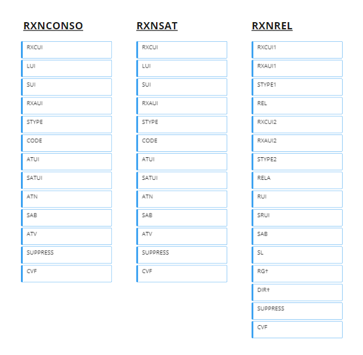
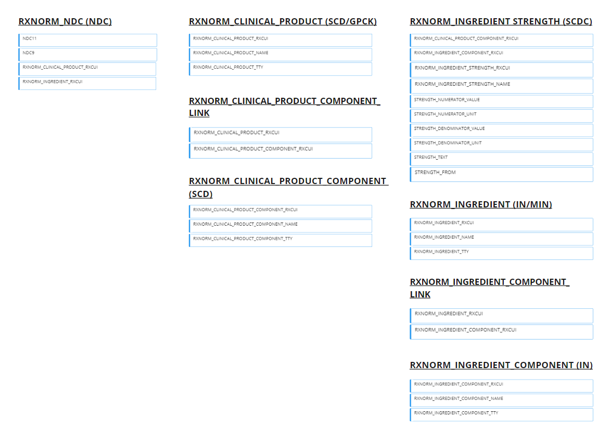

RxNorm is an invaluable resource created and maintained by the National Library of Medicine (NLM). It is a [standard nomenclature to represent drug products](https://academic.oup.com/jamia/article/18/4/441/734170), providing semantic interoperability across many different drug vocabularies and fueling medication-related clinical decision support. However, the way the data within RxNorm is structured is pretty abstract and really difficult to understand without spending several hours reading various different pages of documentation on NLM’s website.

<!--truncate-->

For instance, take a look at the three [RxNorm database tables](https://www.nlm.nih.gov/research/umls/rxnorm/docs/prescribe.html) below and tell me how you would find all of the national drug codes (NDCs) for all of the clinical drug products that contain lisinopril as an ingredient. Bet you can’t figure it out without reviewing at least 4 different NLM sources of documentation.

1. [RxNorm Technical Documentation](https://www.nlm.nih.gov/research/umls/rxnorm/docs/techdoc.html)
1. [RxNorm Term Types](https://www.nlm.nih.gov/research/umls/rxnorm/docs/appendix5.html)
1. [RxNorm Relationships](https://www.nlm.nih.gov/research/umls/rxnorm/docs/appendix1.html)
1. [RxNorm Attributes](https://www.nlm.nih.gov/research/umls/rxnorm/docs/appendix4.html)

*The three tables available in the RxNorm Current Prescribable Content release.*

A quick disclaimer: I really like RxNorm — and I use it periodically — but every time I pick it up again, I have to re-learn the very particular data structure used in the database. The barrier to entry to start writing SQL queries against this data is pretty high, and the resulting SQL code is pretty messy and convoluted in my experience. Despite all of that, RxNorm is still the best comprehensive, public, and freely available data source for drug information that I am aware of.

RxNorm was created based on a “[need for a single, standard, multipurpose terminology for representing medications](https://academic.oup.com/jamia/article/18/4/441/734170)”. It has definitely achieved that, and in doing so, has also become a reliable source of drug information. Computers and researchers (who, I know, are also humans) apparently don’t have an issue with the way the data is stored, but as a clinical and technical person who is familiar with how most relational databases are structured, I would prefer to have the same valuable information presented in a different format.

If we take all of the same data available in the [RxNorm Current Prescribable Content](https://www.nlm.nih.gov/research/umls/rxnorm/docs/prescribe.html) data source, but pre-process it (using SQL) into different tables, it turns into a more human-readable representation of the drug information. Someone familiar with SQL could approach these tables without any special knowledge of RxNorm and work out a pretty basic query to answer the question above. In pseudo-SQL, you could find all the “NDCs” for all the “Clinical Products” that have an “Ingredient” of lisinopril.

*Reimagining the structure of RxNorm data using a familiar relational database structure.*

In my opinion, a view like the one above would be incredibly valuable to a wider range of clinical and technical people because it is more human readable and structured in a familiar way to answer a variety of different questions with only a few lines of SQL code. Nothing needs to change about RxNorm, but having some sort of regularly updated view of the data like this would be a great additional resource for people that want a more granular or complex view of the data than existing tools like [RxNav](https://mor.nlm.nih.gov/RxNav/) or [RxMix](https://mor.nlm.nih.gov/RxMix/) can offer.

Even though the data is the same behind the scenes, having a standardized view like this in a format that is organized more like the view of drug information provided by commercial drug information database providers could give developers at health tech startups a lower barrier to entry (and cheaper alternative) to integrate drug information into their products. It could also make it easier for people to work with other NDC-based medication data and aggregate it using the amazingly useful standardized nomenclature that RxNorm provides.

---

**CodeRx** is a collective of pharmacists and other healthcare professionals that have an interest, skill set, or passion in coding, data, or tech. If you're interested in learning more, follow along at [CodeRx.io](https://coderx.io/), check out our [GitHub repo](https://github.com/coderxio/dailymed-api), or join our [Slack channel](https://join.slack.com/t/coderx/shared_invite/zt-5b8e9kr4-PsKAVe4crGmECQyyxDIJgQ).
