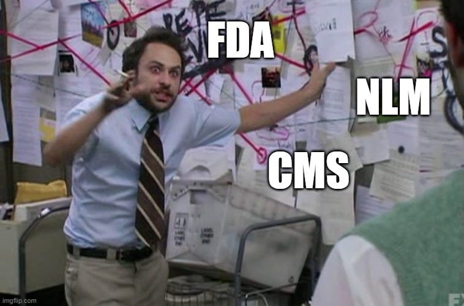

For the past year or so, we've been going down rabbit holes discovering more and more sources of open drug data, each with its own differences and quirks. By "drug data" we mean data about drugs - typically (but not only) from US government sources like the Food and Drug Administration (FDA), National Library of Medicine (NLM), and Centers for Medicare and Medicaid Services (CMS). These organizations do a reasonably good job at presenting and sharing their own siloed data; however, they all seem to use different data formats, structures, and update frequencies.

<!--truncate-->

You would have to be some weird combination of data scientist, software engineer, and clinician to sustainably aggregate and combine data from these sources in a meaningful way.

Luckily we are.

*An actual image of me trying to explain to someone what I’ve been working on for the past year.*

When we say open drug data is not “easy”, here are a few examples of what we mean:

1. **NLM DailyMed** is a major source of structured product label (SPL) information - you know, those 6-point font paper printouts that sometimes accompany a prescription you get from the pharmacy. This data is very valuable and contains structured information about inactive ingredients, package contents, label images, and more. The problem is that all of this data is stored in XML using a specific XML template format used by FDA for label submissions, and each SPL’s XML and images is contained within a zip file. So there’s 40,000 zip files (one per SPL) inside of four or more other zip files (because putting all of that in one zip file would be unwieldy) and at the bottom of all that, you still have to deal with parsing through the XML documents.

2. FDA National Drug Code (NDC) Directory is our go-to source for NDC-level information, but there are a few problems with how the data is presented. First, in order for the data to be shared as a flat text file, information about things like drug classes, substances, and active ingredient strengths are concatenated into single columns and separated by delimiters (i.e. comma or semicolon delimited). That information would be much more valuable in a normalized relational database format. Second, in order to join FDA NDC data to other data sources from NLM and CMS, you first need to normalize the NDCs to NDC11 format; however, the FDA does not have a column for an NDC11 formatted NDC so you need to somehow normalize this yourself every time you need to work with these combined sources.

3. CMS National Average Drug Acquisition Cost (NADAC) is arguably the best openly available source of drug pricing information for drugs covered by Medicaid. CMS outsources the collection of pharmacy pricing surveys and then hosts the aggregated data on its website. We have found that this data is often not de-duplicated week to week, which requires an extra cleanup step before working with it. Also, the file name of the CSV file uploaded every week contains the date the file was uploaded. Generally, this is always a Wednesday, but sometimes it is a Tuesday or a Thursday. From the perspective of trying to automate the download of this data every week, this presents a challenge because not only do you have to change the file name every week, but the file name is not consistently the same day of the week.

4. NLM RxNorm is the widely agreed-upon standard for open medication terminology. The NLM hosts both an application programming interface (API) and also all of the files needed to load RxNorm into a database. Unfortunately, it only provides a guide for loading this data into a MySQL or Oracle database. So if you wanted to use a different database (PostgreSQL, for instance), you will need to figure out how to work with the RRF-format files yourself. Also, if you are not familiar with APIs or working with databases and just want to work with this information in a flat file format, you are out of luck. Even if you are familiar with working with databases, the bulk of the data is contained in three very abstract-sounding tables that don’t follow relational database normalization rules. This makes the barrier to entry high even for someone with a technical background.

We could go on, but you probably get the idea. Open drug data holds a lot of value, but reliably accessing this value on a ongoing basis requires either a well thought-out data pipeline infrastructure or a lot of error-prone manual work. When neither of these options sound very appealing, a popular choice is to license a commercial drug information database. For health systems, corporations, and funded startups, this is probably the best choice because it comes with a team of clinical reviewers, salespeople, and support staff. For many others looking for a source of machine-readable drug information, the price tag for such a system is likely not affordable.