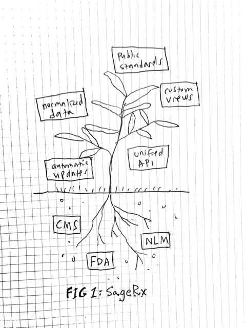
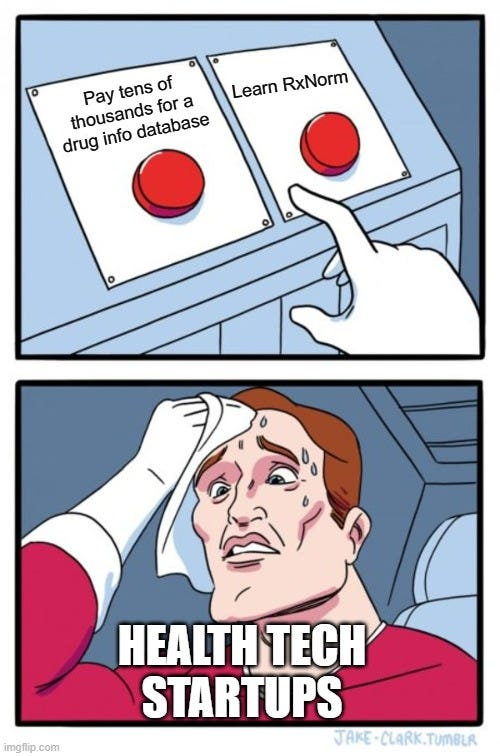

# About

## What is SageRx?

SageRx is an open drug data pipeline. It takes many different public sources of data in many different formats, normalizes them in a single database, and enhances them with custom views built and tested by pharmacists. Not only does it automatically keep the data "up-to-the-day" current, it also connects the data in meaningful ways that aren’t easily possible otherwise.

Right now, SageRx is:

1. A regularly updated database available to query, and...
1. Regularly updated flat files available to download.

Eventually, we plan to add a developer-friendly API and a library of medication-related widgets (think CPOE, patient med lists, med rec, etc) that use SageRx as a data source.

## Why did we build it?

Even though this data is publicly available, it comes in different formats and is updated at different frequencies. Also, there are differences in the way things like NDC (or other “should-be” standards) are formatted between different data sources, which means making connections between different data can be difficult.

As pharmacists who have been trying to develop medication-related software, we have run into many of these problems over the past several years. The alternative to using these disparate (*but free*) data sources is paying expensive licensing fees for a professional drug information database.

While we wanted to continue developing potentially useful software, we didn’t feel like paying thousands of dollars per year was a logical thing to do as a starting point. So instead we decided to hit pause and start building an alternative for people like us.

## Who needs it?

- Health tech startups
- Researchers
- Data analysts
- You, maybe

For anyone trying to build a prototype, answer a question, or tell a story using medication data, we offer a reliable source of aggregated data. Though the data is not curated or validated by us, the ease of access to this regularly updated data solves a pain point for some groups of people.

Certainly, professionally maintained medication information databases are more suited to larger organizations and production-ready apps. However, the barrier to entry to access drug information to prove a concept tends to be high — both financially and operationally.

## What can you do with it?

Use the database and flat files as you might use your main medication information resource. We are curious to know how SageRx compares to your current workflow for doing various medication-related tasks in terms of ease-of-use and accuracy.

Below are some examples of questions you could try to answer with SageRx and compare it to how you would otherwise accomplish the task.

- Which NDCs could be substituted for Zestril?
- Which dose forms is prednisone available in as a single ingredient product?
- What are the individual ingredient(s) that comprise NDC 00597014660?
- Which EPC medication class has the highest number of FDA approvals in the past 90 days?
- What is the cheapest NDC per billing unit for HCPCS code J3370?
- What is the maximum number of tablets of RXCUI 857005 that would total less than 3000 mg of acetaminophen?
