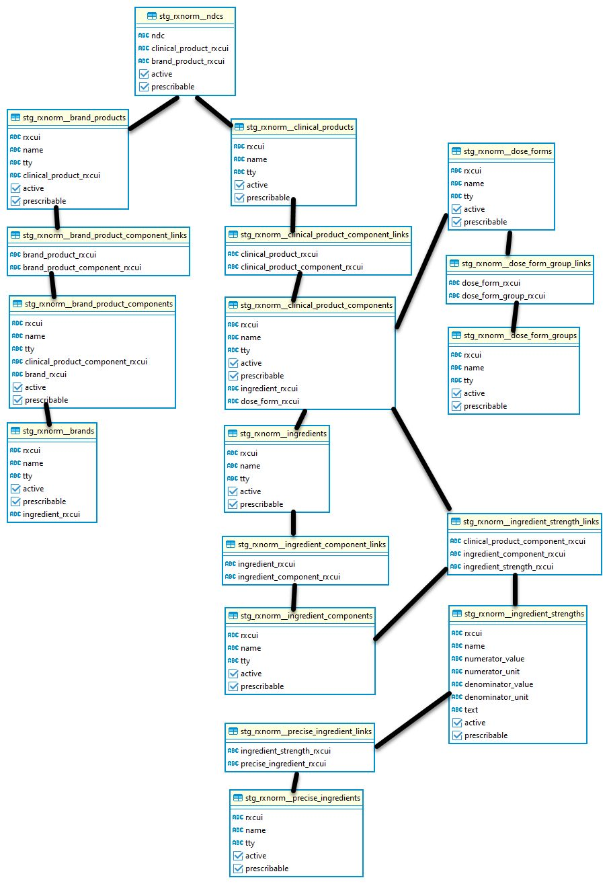

# RxNorm

## Staging

The `staging` schema contains data models that represent the most clinically useful elements of the data within RxNorm.

### NDCs

One row per NDC with links to clinical products (and brand products where the NDC has an associated brand product per RxNorm). You can use this table to quickly determine if an NDC has an associated brand product. All NDCs should have an associated clinical product.

### Brand products

If an NDC has an associated brand product (BPCK / SBD), this table will link to the brand name as well as the associated clinical product.

If a brand product is a package that has multiple components (BPCK), this table will also link to the base brand product components (typically SBD).

### Brands

This table contains brand names for brand products. You can also get to the clinical product ingredients from this table.

### Clinical products

Every NDC should have an associated clinical product (GPCK / SCD), even though not every NDC has an associated brand product.

Like brand products, clinical products can be packaged with multiple clinical product components (GPCK).  This table links to to the base clinical product components (typically SCD).

### Ingredients

From this point onward, we forego brand products (since they are just branded clinical products) and focus on how clinical products link to other things like ingredients. 

Clinical products (SCD) can have single ingredients (IN) or multiple ingredients (MIN). If a clinical product contains a multiple ingredient (MIN), you can link to the base individual ingredient componentss (IN) using tables here.

### Ingredient strengths

Ingredients strengths are represented by the SCDC term type (TTY) in RxNorm. 

Because you need to know which product and which ingredient in that product to determine strength, the ingredient strength table in SageRx links to both the clinical product and ingredient tables.

In this table, you can determine the numeric ingredient strength and map the units from RxNorm to your system to calculate total dosage for products.

### Dose forms

Clinical product components (SCD) have generally one dose form (DF) in RxNorm. An oral tablet is an oral tablet, and an oral capsule is an oral capsule.

### Dose form groups

Individual dose forms (DF) can belong to multiple dose form groups (DFG). This can be helpful if you are looking for all oral products, for instance, and don't care about the difference between oral tablets and oral capsules.

## Intermediate

The `intermediate` schema builds upon the `staging` schema and creates time-saving pathways between things that people working with drug data tend to want to know.

A few example tables are listed below:

### NDC to clinical product

This lets you go from NDC to all the information about the clinial product that NDC represents. This table does not differentiate between brands and generics.

### NDC to product

This is similar to the table above, but if an NDC has an associated brand product, it will return the brand product information as opposed to the clinical product information.

This is helpful if you are doing cost analysis and need to know why one NDC is more expensive than another even though they represent the same clinical product (hint: one NDC might be a brand product).

### Clinical product to ingredient strength

This is a useful table for calculating total daily dosage for a given product or for giving users a pick list of strength options for a given clinical product.

### Clinical product to dose form

If you are trying to determine what dose form a clinical product is, this table can quickly give you an answer.
